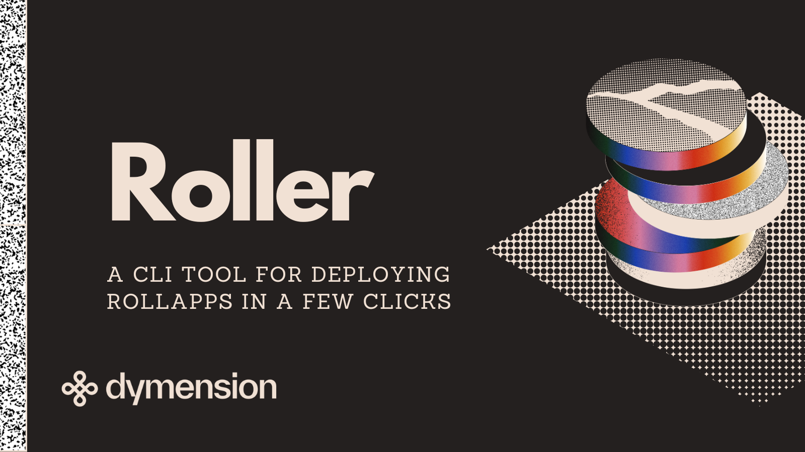

# Roller CLI



## Introduction

Roller CLI is a command-line interface tool designed to facilitate the creation
and operation of RollApps on the Dymension Hub.
It allows developers to effortlessly spin up and run RollApps, simplifying the
development process and making the Dymension Hub
more accessible.

## Local Development

To build and test the latest version from the main branch:

First, install all the necessary dependencies using the following command:

```bash
curl https://raw.githubusercontent.com/dymensionxyz/roller/main/install.sh | bash
```

Next, clone this repository. Once cloned, navigate to the root directory and execute:

```bash
make build
```

This command builds the latest version of Roller and places the executable
in the `./build` directory.

To run Roller, use:

```bash
./build/roller
```

## Testing

To run all the tests, run from the root directory:

```bash
go test ./...
```

## Installing a Pre Release

To install a specific pre-release version, use:

```bash
export ROLLER_RELEASE_TAG="<RELEASE_TAG>"
curl https://raw.githubusercontent.com/dymensionxyz/roller/main/install.sh | bash
```

For more information about Roller and its usage, please refer to [the documentation](https://docs.dymension.xyz/run/operate/overview).

## Contribution

[pre-commit](https://pre-commit.com/) will help you with the hooks that will make sure you follow the style guidelines, once installed
run:

```sh
pre-commit install -c .pre-commit-config.yaml -t commit-msg
pre-commit install -c .pre-commit-config.yaml
```
